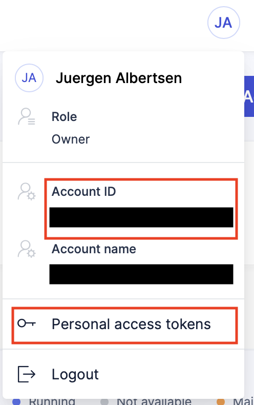
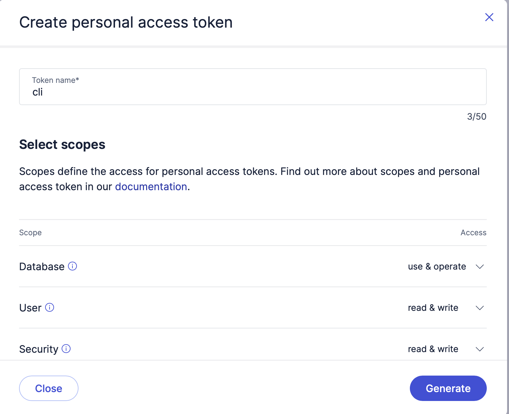
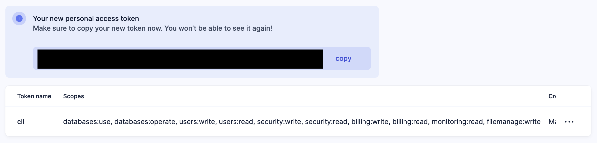

# Exasol SaaS CLI

A command-line interface for managing Exasol SaaS resources — databases, clusters, and account security.

## 🚀 Get Started

### Install

```bash
curl -fsSL https://raw.githubusercontent.com/exasol-labs/saas-cli/main/install.sh | sh
```

### Explore commands

```bash
exasol-saas --help
```

## 🗄️ How to Create a Database

The sample script [`examples/setup-sample-db.sh`](examples/setup-sample-db.sh) walks through the full flow below end-to-end.

### 📦 Recommended Tools

- **exapump** — to run queries against the database:
  ```bash
  curl -fsSL https://raw.githubusercontent.com/exasol-labs/exapump/main/install.sh | sh
  ```
- **jq** — to parse JSON output from the CLI:
  ```bash
  brew install jq          # macOS
  sudo apt-get install jq  # Debian/Ubuntu
  sudo dnf install jq      # RHEL/Fedora
  ```

### 🔑 Set up credentials

You need your Exasol SaaS account ID and a personal access token (PAT).

**Account ID** — click your avatar in the top-right corner. The account ID is shown in the dropdown.



**Personal access token** — click **Personal access tokens** in the same dropdown, then click **Generate**. Give it a name (e.g. `cli`) and select the required scopes.



Copy the token immediately — it won't be shown again.



Export both values as environment variables (recommended), or pass them via `--account-id` and `--token` flags on each command:

```bash
export EXASOL_SAAS_TOKEN=your-token
export EXASOL_SAAS_ACCOUNT_ID=your-account-id
```

### ⚡ From zero to first query

**1. 🗄️ Create a database**

Use `database create` to provision a new database. The following flags are required:

| Flag | Description |
|---|---|
| `--name` | Database name, e.g. `AnalyticsDB` |
| `--region` | AWS region to deploy into, e.g. `eu-west-1`. See the [SaaS console](https://cloud.exasol.com) for available regions. |
| `--cluster-name` | Name of the main cluster, typically `MainCluster` |
| `--cluster-size` | Cluster size, e.g. `XS` or `M`. See the [SaaS console](https://cloud.exasol.com) for available sizes and pricing. |

```bash
exasol-saas database create \
  --name SampleDatabase --region eu-west-1 \
  --cluster-name MainCluster --cluster-size S
```

The command prints the new database's details:

| ID | Name | Status | Provider | Region | CreatedAt |
|---|---|---|---|---|---|
| wMAeitbNT4uxJk5JpqH8XA | SampleDatabase | starting | aws | eu-west-1 | 2026-03-27T09:12:00Z |

Use `--output json` and `jq` to capture the ID directly:

```bash
DB_ID=$(exasol-saas database create \
  --name SampleDatabase --region eu-west-1 \
  --cluster-name MainCluster --cluster-size S \
  --output json | jq -r '.id')
```

The database takes a few minutes to start. Use `database status` to check when it's ready:

```bash
exasol-saas database status "$DB_ID"
```

| ID | Name | Status | Provider | Region | CreatedAt |
|---|---|---|---|---|---|
| wMAeitbNT4uxJk5JpqH8XA | SampleDatabase | running | aws | eu-west-1 | 2026-03-27T09:12:00Z |

**2. 🔍 Get the cluster ID**

Once the status is `running`, list the database's clusters:

```bash
exasol-saas cluster --database-id "$DB_ID" list
```

| ID | Name | Status | Size | Family | Main | CreatedAt |
|---|---|---|---|---|---|---|
| uKLkHAxJTJSCy-6Ngb30Iw | MainCluster | running | S | r6id | true | 2026-03-27T09:12:00Z |

Use `--output json` and `jq` to capture the cluster ID directly:

```bash
CLUSTER_ID=$(exasol-saas cluster --database-id "$DB_ID" list --output json | jq -r '.[0].id')
```

**3. 🌐 Allow network access**

Add an IP allowlist rule before connecting. The following command allows connections from any IP:

```bash
exasol-saas security create --name public --cidr-ip 0.0.0.0/0
```

**4. 🔌 Get connection details**

Retrieve the connection details for the cluster:

```bash
exasol-saas cluster --database-id "$DB_ID" connect "$CLUSTER_ID"
```

| DNS | Port | JDBC | Username |
|---|---|---|---|
| xcroihamjfgjjawl52gydppuem.clusters.exasol.com | 8563 | xcroihamjfgjjawl52gydppuem.clusters.exasol.com | your-user |

Use `--output json` and `jq` to capture the values directly:

```bash
CONN=$(exasol-saas cluster --database-id "$DB_ID" connect "$CLUSTER_ID" --output json)
DB_HOST=$(echo "$CONN" | jq -r '.dns')
DB_PORT=$(echo "$CONN" | jq -r '.port')
DB_USER=$(echo "$CONN" | jq -r '.dbUsername')
```

**5. 🎉 Run a query**

Use [exapump](https://github.com/exasol-labs/exapump) to run a query against the database:

```bash
exapump sql \
  --dsn "exasol://${DB_USER}:${EXASOL_SAAS_TOKEN}@${DB_HOST}:${DB_PORT}/?tls=true" \
  'SELECT 1'
```

Your database is up and running. 🎉
